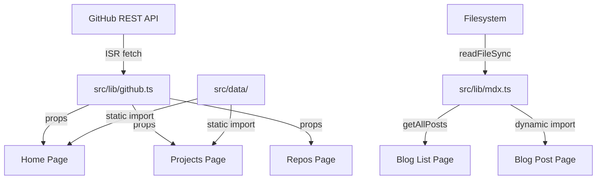

# Architecture

## Overview

A modern Next.js 16 developer portfolio that showcases GitHub projects, a live repo grid, an MDX-powered blog, and automated profile README generation. Built with the App Router, it fetches data from the unauthenticated GitHub REST API using Incremental Static Regeneration (ISR) — no API keys required.

## Directory Map

```
.
├── src/
│   ├── app/               # Next.js App Router pages & layouts
│   │   ├── layout.tsx     # Root layout (metadata, providers, nav, footer)
│   │   ├── page.tsx       # Home page (hero + about/skills)
│   │   ├── projects/      # Featured projects showcase
│   │   ├── repos/         # Live GitHub repo grid with filtering
│   │   ├── blog/          # MDX blog (list + [slug] detail pages)
│   │   │   └── [slug]/    # Dynamic blog post routes
│   │   └── contact/       # Contact page
│   ├── components/
│   │   ├── hero/          # Hero section with typewriter
│   │   ├── nav/           # Navbar with mobile sheet
│   │   ├── repos/         # Repo grid, cards, filters
│   │   ├── projects/      # Project cards
│   │   ├── about/         # About section with skills
│   │   ├── layout/        # Providers, footer
│   │   ├── shared/        # AnimatedReveal, GradientText, GitHubIcon, SectionWrapper
│   │   └── ui/            # shadcn/ui primitives
│   ├── content/
│   │   └── posts/         # MDX blog posts (file-based, no CMS)
│   ├── data/              # Static data (projects, skills, nav links)
│   ├── lib/               # Shared utilities (GitHub API, MDX utils, types)
│   └── styles/            # (unused; globals.css lives in app/)
├── scripts/
│   └── generate-profile-readme.ts  # Profile README automation
├── .github/
│   └── workflows/
│       └── update-profile-readme.yml  # Auto-update jtmb/jtmb README
├── mdx-components.tsx     # @next/mdx custom component overrides
├── next.config.ts         # MDX + image config
├── postcss.config.mjs     # Tailwind v4 PostCSS plugin
└── tsconfig.json
```

## Key Components

### GitHub API Layer (`src/lib/github.ts`)

Single source of truth for all GitHub data. Exports typed fetch functions:

- `getUser()` — User profile (ISR: 86400s)
- `getRepos()` — All public repos (ISR: 3600s)
- `getRepo(name)` — Single repo detail (ISR: 3600s)
- `getTotalStars()` — Aggregate star count across repos
- `getTopLanguages(n)` — Top N languages by repo count

All functions use a shared `githubFetch()` wrapper with 10s timeout and ISR `next.revalidate` support. Returns `T | null` — callers handle null gracefully.

### Pages

| Route | Type | Data Source | Revalidation |
|-------|------|-------------|--------------|
| `/` (Home) | Async Server | `getUser()`, `getRepos()`, `getTopLanguages()` | ISR per fetch |
| `/projects` | Async Server | `featuredProjects` static data + `getRepo()` for stars | ISR 86400s |
| `/repos` | Async Server → Client | `getRepos()` (server), `<RepoGrid>` (client) | ISR 3600s |
| `/blog` | Static (filesystem) | `getAllPosts()` reads `src/content/posts/` | Build time |
| `/blog/[slug]` | Static + dynamic import | `generateStaticParams` + MDX import | Build time |
| `/contact` | Static | None (pure markup) | N/A |

### Client Components

- **Navbar** — Sticky header, theme toggle, mobile Sheet, path-based active state
- **Hero** — Typewriter animation (respects `prefers-reduced-motion`), animated entrance
- **RepoGrid / RepoFilter** — Language chips, text search, sort (updated/stars/name)
- **AnimatedReveal** — Scroll-triggered fade-in (skips animation if prefers-reduced-motion)

### Blog System

MDX files in `src/content/posts/` with YAML frontmatter. No database, no CMS:

1. `getAllPosts()` reads filesystem at build time → generates static params
2. `[slug]/page.tsx` dynamically imports `@/content/posts/${slug}.mdx`
3. `mdx-components.tsx` provides custom component overrides (code blocks, links, typography)
4. `@tailwindcss/typography` plugin provides `prose` styling

## Data Flow



## Communication Patterns

- **Server → Client**: Server components fetch data, pass as props to client components
- **Client → Server**: None. No API routes, no database. Purely static + ISR reads
- **GitHub API**: Unauthenticated REST API (60 req/hr). ISR keeps requests under this limit

## External Dependencies

| Dependency | Purpose | Auth |
|------------|---------|------|
| GitHub REST API v3 | Repo data, user profile | None (public) |
| Vercel | Hosting, ISR cache | Deploy hook |
| github-readme-stats | Profile README badges | None |

## Deployment

- **Platform**: Vercel (free tier)
- **Build**: `next build` → static pages + ISR pages
- **Runtime**: Node.js serverless functions for ISR revalidation
- **CI/CD**: GitHub Actions updates `jtmb/jtmb/README.md` every 6 hours
